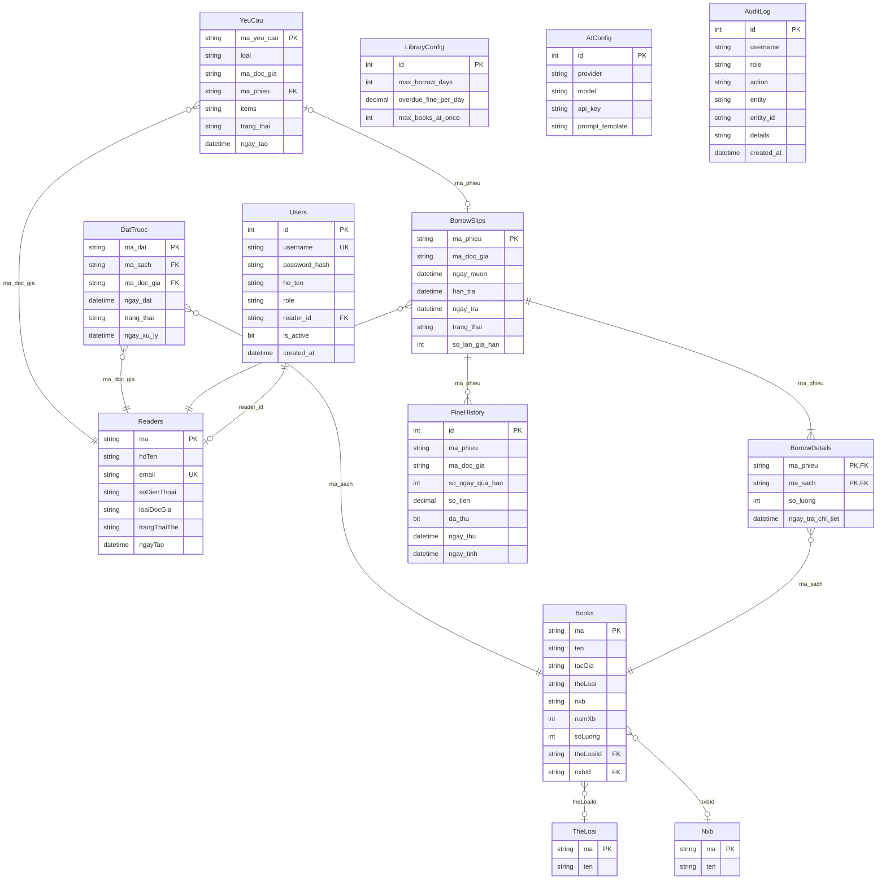

# ERD — Thiết kế cơ sở dữ liệu
## Hệ thống quản lý thư viện có tích hợp AI

> Vẽ từ migrations 0001-0008 (SQL Server, bảng `LibraryDB`).

## Bảng + khóa chính/ngoại + ràng buộc chính

| Bảng | PK | FK | Ràng buộc |
|---|---|---|---|
| Users | id | reader_id → Readers.ma | role IN (admin/librarian/reader); username unique; is_active |
| Readers | ma | — | email unique; loai IN (sinh_vien/giang_vien/khac); trangThaiThe IN (hoat_dong/khoa) |
| Books | ma | theLoaiId → TheLoai.ma; nxbId → Nxb.ma | soLuong ≥ 0 |
| TheLoai / Nxb | ma | — | không rỗng |
| BorrowSlips | ma_phieu | ma_doc_gia (logical → Readers) | trang_thai IN (dang_muon/da_tra); so_lan_gia_han ≥ 0 |
| BorrowDetails | (ma_phieu, ma_sach) | ma_sach → Books.ma | so_luong > 0 |
| FineHistory | id | ma_phieu (logical → BorrowSlips) | so_ngay_qua_han ≥ 0; so_tien ≥ 0; da_thu |
| DatTruoc | ma_dat | ma_sach → Books.ma; ma_doc_gia → Readers.ma | trang_thai IN (CHO_XU_LY/SAN_SANG/DA_MUON/HUY); unique active (sách+độc giả) |
| YeuCau | ma_yeu_cau | ma_doc_gia (logical) | loai IN (MUON/TRA/GIA_HAN); trang_thai IN (CHO_XU_LY/DA_DUYET/TU_CHOI) |
| LibraryConfig | id (=1) | — | max_borrow_days > 0; overdue_fine_per_day ≥ 0; max_books_at_once > 0 |
| AIConfig | id (=1) | — | singleton |
| AuditLog | id | — | tự ghi mọi thao tác quan trọng |
