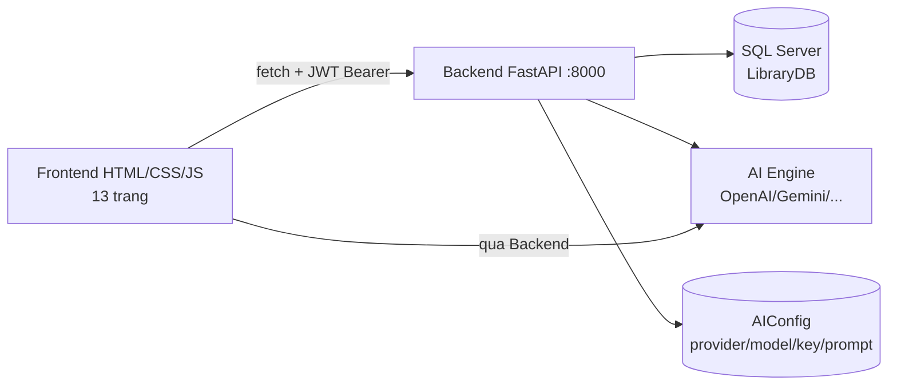

# Kiến trúc hệ thống

## Thành phần

1. **Frontend** (`Frontend/`): HTML/CSS/JS thuần, không framework; `js/api.js` là lớp gọi API tập trung (endpoints, fieldMap, roleMap); `js/auth.js` quản lý phiên + phân quyền hiển thị theo `data-roles`; 13 trang: login, register, search, books, readers, borrow, my-borrows, requests, reservations, notifications, stats, admin-accounts, admin-catalog, admin-config.
2. **Backend** (`Backend/`): FastAPI + SQLAlchemy + Alembic, 12 router: auth, books, readers, borrows, requests, reservations, notifications, stats, export, accounts, catalog, admin (config/audit/backup/restore). Mọi API trả JSON; xác thực JWT; phân quyền theo role; audit log tự động.
3. **CSDL** (`LibraryDB`, SQL Server): 13 bảng theo ERD; migrations 0001-0008.
4. **AI Engine** (`AI_Engine/`): nhận dữ liệu sách đã lọc qua Backend, gọi LLM theo `AIConfig` (admin cấu hình), trả kết quả qua Backend — không gọi thẳng từ Frontend, không đụng thẳng DB.

## Luồng dữ liệu chính

- **Tra cứu:** Reader → search.html → GET /api/books?q=&theLoai=&trangThai= → danh sách sách.
- **Mượn/trả (tại quầy):** Thủ thư → borrow.html → POST /api/borrows (giảm số lượng, tính hạn trả); PUT .../return (tăng số lượng, tính phạt).
- **Yêu cầu online:** Reader → requests.html → POST /api/requests → Thủ thư duyệt (approve) → hệ thống tạo phiếu/trả/gia hạn.
- **Đặt trước:** Reader đặt khi sách hết → trả sách kích hoạt SAN_SANG → Thủ thư fulfill → độc giả đến lấy, thủ thư lập phiếu mượn.
- **AI:** Reader hỏi chatbot → Frontend → POST /api/ai/search (Backend lọc dữ liệu sách, ẩn nhạy cảm) → AI Engine → trả gợi ý + lý do.

## Bảo mật

- JWT HS256, mật khẩu hash; mọi API kiểm tra token + role (401/403).
- Admin không thao tác mượn/trả/đặt trước; reader chỉ dữ liệu của mình.
- API key AI chỉ ở Backend (AIConfig), không lên Frontend; trả về dạng che.
