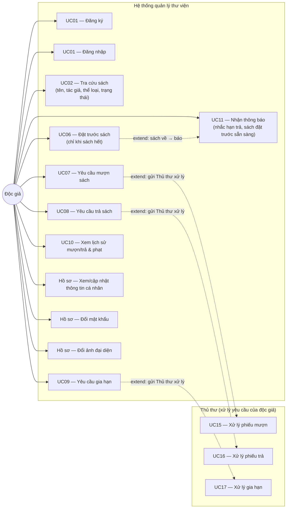

# Sơ đồ Use Case — Độc giả (KT2, chưa tích hợp AI)

> Bám sát đề tài (mục 3.1, 3.2) + ứng dụng đã triển khai. AI-1/2/3 (UC03/04/05) sẽ thêm vào sơ đồ sau khi làm KT3.

## Ghi chú

- **Độc giả không tự mượn/trả/gia hạn trực tiếp** — chỉ gửi **Yêu cầu** (UC07/08/09); Thủ thư xử lý (UC15/16/17). Đúng phân vai đề tài.
- **Đặt trước** chỉ được tạo khi sách hết/đang mượn hết; khi sách trả về hệ thống chuyển thành "Sẵn sàng" và thông báo (UC11).
- **Hồ sơ cá nhân** (P1/P2/P3) là phần mở rộng đã triển khai (Profile).
- **AI-1/2/3 (UC03/04/05)** chưa vẽ — sẽ bổ sung ở giai đoạn KT3.
