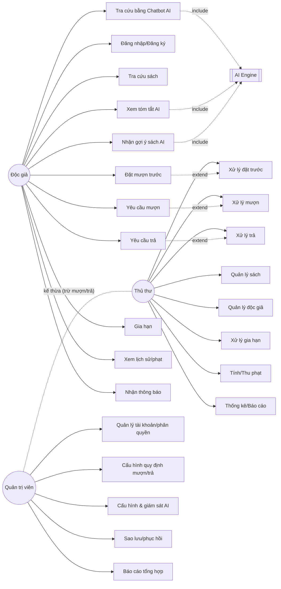

# Phân tích Actor & Use Case
## Hệ thống Quản lý Thư viện tích hợp AI (Đề tài 02)

> Bản này giữ nguyên tài liệu 28 UC đã chốt, bổ sung nhãn **(Mở rộng)** cho các use case ngoài đề bài và cột hiện trạng.

## 1. Actor

### 1.1 Actor chính

| Actor | Vai trò |
|---|---|
| Độc giả | Tra cứu, mượn/trả (qua yêu cầu), dùng chatbot AI, đặt trước, xem lịch sử |
| Thủ thư | Vận hành: sách, mượn/trả, phạt, đặt trước, thống kê |
| Quản trị viên | Tài khoản, phân quyền, cấu hình hệ thống/AI, giám sát |

### 1.2 Actor phụ

| Actor | Vai trò |
|---|---|
| AI Engine | Nhận prompt, trả kết quả gợi ý/tóm tắt/trả lời (được hệ thống gọi) |
| Cơ sở dữ liệu | Lưu trữ sách, độc giả, phiếu mượn... |

## 2. Use Case theo Actor

### 2.1 Độc giả

| Mã | Use Case | Input | Output | Trạng thái |
|---|---|---|---|---|
| UC01 | Đăng ký / Đăng nhập | Tài khoản, mật khẩu | Phiên đăng nhập | ✅ |
| UC02 | Tra cứu sách (thường) | Từ khóa, thể loại, tác giả | Danh sách sách, trạng thái | ✅ |
| UC03 | Tra cứu bằng AI (Chatbot) | Câu hỏi NL tự nhiên | Sách gợi ý + lý do | ⏳ AI-1 |
| UC04 | Xem tóm tắt sách do AI sinh | Mã sách | Đoạn tóm tắt ngắn | ⏳ AI-2 |
| UC05 | Nhận gợi ý sách liên quan | Lịch sử mượn, thể loại | Danh sách đề xuất | ⏳ AI-3 |
| UC06 | Đặt mượn trước | Mã sách đang hết | Phiếu đặt trước | ✅ |
| UC07 | Yêu cầu mượn sách **(Mở rộng)** | Mã sách | Yêu cầu gửi thủ thư | ✅ |
| UC08 | Yêu cầu trả sách **(Mở rộng)** | Mã phiếu | Yêu cầu gửi thủ thư | ✅ |
| UC09 | Gia hạn mượn **(Mở rộng)** | Mã phiếu | Hạn mới (nếu không ai đặt trước) | ✅ |
| UC10 | Xem lịch sử mượn/trả & phạt **(Mở rộng)** | — | Lịch sử + phạt | ✅ |
| UC11 | Nhận thông báo **(Mở rộng)** | — | Nhắc hạn trả, sách đặt trước đã có | ✅ |

### 2.2 Thủ thư

| Mã | Use Case | Input | Output | Trạng thái |
|---|---|---|---|---|
| UC12 | Đăng nhập quyền thủ thư | Tài khoản | Phiên làm việc | ✅ |
| UC13 | Quản lý sách CRUD | Thông tin sách | Danh mục cập nhật | ✅ |
| UC14 | Quản lý độc giả | Hồ sơ độc giả | Hồ sơ cập nhật | ✅ |
| UC15 | Xử lý phiếu mượn | Yêu cầu từ độc giả | Phiếu mượn, giảm số lượng | ✅ |
| UC16 | Xử lý phiếu trả | Yêu cầu trả | Cập nhật kho, tính phạt | ✅ |
| UC17 | Xử lý gia hạn | Mã phiếu | Hạn mới / từ chối nếu có đặt trước | ✅ |
| UC18 | Xử lý đặt trước | Danh sách đặt trước, sách vừa trả | Sẵn sàng cho độc giả kế tiếp | ✅ |
| UC19 | Tính & thu phạt | Ngày trả, ngày hạn | Số tiền phạt, trạng thái đã thu | ✅ |
| UC20 | Thống kê & xuất báo cáo | Khoảng thời gian, tiêu chí | Sách mượn nhiều, độc giả hoạt động, sách quá hạn | ✅ |
| UC21 | Kiểm duyệt nội dung AI **(Mở rộng, tùy chọn)** | Kết quả AI | Xác nhận/điều chỉnh | ⏳ cùng AI |

### 2.3 Quản trị viên

| Mã | Use Case | Input | Output | Trạng thái |
|---|---|---|---|---|
| UC22 | Đăng nhập quyền admin | Tài khoản | Phiên làm việc | ✅ |
| UC23 | Quản lý tài khoản & phân quyền **(Mở rộng — đã chốt giữ)** | Thông tin tài khoản | Tạo/khoá tài khoản thủ thư/độc giả | ✅ |
| UC24 | Cấu hình quy định mượn/trả **(Mở rộng)** | Số ngày, phạt/ngày, giới hạn | Bộ quy định áp dụng | ✅ |
| UC25 | Quản lý danh mục thể loại/NXB **(Mở rộng)** | Tên thể loại, NXB | Danh mục dùng chung | ✅ |
| UC26 | Cấu hình & giám sát AI **(Mở rộng)** | Model, prompt, giới hạn | Log gọi AI, cảnh báo | ⏳ UI + giám sát |
| UC27 | Sao lưu & phục hồi **(Mở rộng)** | — | File backup / CSDL khôi phục | ✅ (UI đã có) |
| UC28 | Xem báo cáo tổng hợp **(Mở rộng)** | — | Thống kê toàn cục | ✅ |

## 3. Sơ đồ Use Case (Mermaid)

> Ghi chú: Admin kế thừa quyền thủ thư **ngoại trừ thao tác mượn/trả/gia hạn/đặt trước** (theo quyết định người dùng 2026-08-09).
